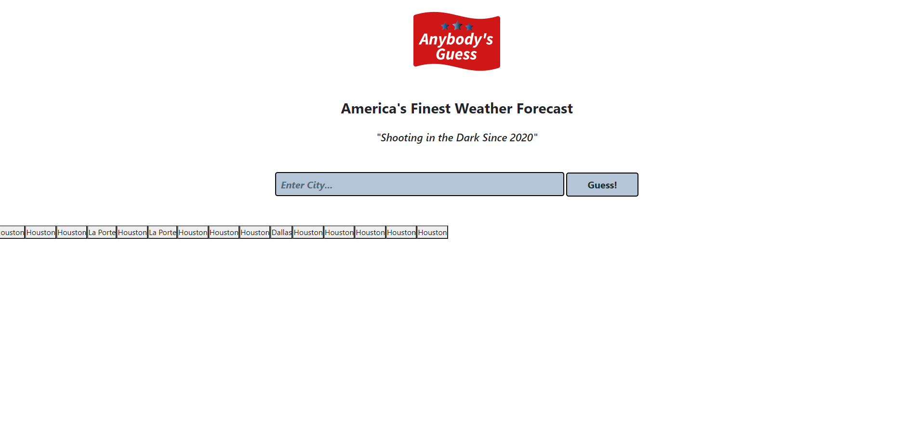

Weather Dashboard - Brad Doremus - "Anybody's Guess: America's Most Trusted Weather Forecast"

Brad Doremus
GitHub: https://github.com/Doremus256/WeatherDashboard
Live Website: https://doremus256.github.io/WeatherDashboard/

This project is for Homework #6 - Create a weather dashboard

The goal here was to access the Open Weather Map API in order to create a weather forecast application. 

Using JQuery and AJAX, I was able to pull in relevant data and display it on the screen when the user searches for a city in the Open Weather Map API's database. 

Using localStorage, I was able to save past searches, and display them on the DOM for the user to reference. 

The layout leaves a lot to be desired still but I plan to come back to this like the two previous homeworks to add additional improvements when I have more time. 

